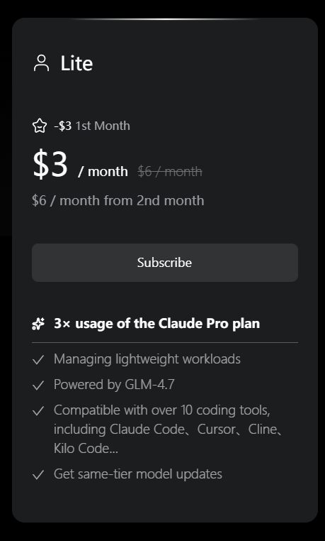

<p align="center">
  
</p>

<h1 align="center">OpenCowork</h1>

<p align="center">
  开源桌面级 AI 助手
</p>

<p align="center">
  <a href="./README.md">English</a> · <a href="./README_CN.md">中文</a>
</p>

<p align="center">
  <a href="https://github.com/Safphere/opencowork/releases"></a>
  <a href="https://github.com/Safphere/opencowork/actions"></a>
  <a href="./LICENSE"></a>
</p>

---

## ⚠️ 风险提示

OpenCowork 允许 AI 操作本地文件系统和终端，使用前请注意：

- AI 可能误删文件或执行错误命令
- 可能存在提示词注入风险
- AI 可读取授权目录内的所有文件

**建议：** 仅授权必要目录、定期备份数据、审查操作请求。

> **免责声明：** 本软件按"原样"提供，仅供学习与开发用途。开发者不对使用本软件造成的任何损失承担责任。

---

## 简介

<p align="center">
  
</p>

**OpenCowork** 是 Cowork 的开源版本，可以将个人电脑变成 AI 驱动的工作助手。

支持接入任何具备 Agent 能力的模型（如 MiniMax、Claude、GPT 等），不绑定特定厂商。

### 主要特点

- **模型通用** — 支持各类 Agent 模型
- **文件操作** — 读写、创建、修改本地文件
- **终端控制** — 执行命令行操作
- **多会话支持** — 同时管理多个对话上下文
- **技能扩展** — 通过 Skill 和 **MCP 协议** 扩展功能
- **跨平台** — 支持 Windows、macOS、Linux

---

## 核心功能

### 技能系统

内置 **11 个 Skill** 和 **10 个 MCP 服务**（整合了 MiniMax、智谱等 **Coding Plan** 服务），开箱即用，支持 **联网搜索**、**网页阅读**、**理解图像** 等基础扩展功能。

> 本项目暂时支持 **ClaudeCode 兼容接口**（如 Anthropic 格式），而非标准 OpenAI SDK 接口。

支持标准 **MCP 协议** 和自定义 Skill 扩展。

<p align="center">
  
</p>

### 悬浮球

通过 `Alt+Space` 快捷键快速唤起（支持在设置中自定义）。全新升级的 UI 设计，流畅的动画效果，以及更优的性能体验。

<p align="center">
  
</p>

---

## 合作伙伴

特别感谢以下合作伙伴的支持：

<div align="center">

| **MiniMax (国内版)** | **MiniMax (International)** | **智谱 AI (Zhipu AI)** | **ZAI (International)** |
| :---: | :---: | :---: | :---: |
|  |  |  |  |
| <a href="https://platform.minimaxi.com/subscribe/coding-plan?code=HhNfBTQDNq&source=link"></a> | <a href="https://platform.minimax.io/subscribe/coding-plan?code=DQlmOtIjX6&source=link"></a> | <a href="https://www.bigmodel.cn/glm-coding?ic=QBPPSNQ5JT"></a> | <a href="https://z.ai/subscribe?ic=9GTHAGUUX1"></a> |

</div>

<p align="center">
  <sub>🤝 我们期待与更多 AI 模型厂商建立合作，共同推进 Agent 生态发展。<a href="mailto:a976466014@gmail.com">联系我们</a></sub>
</p>

---

## 安装

### macOS 用户注意事项

⚠️ **重要：首次打开可能提示"已损坏"**

**原因：** macOS 会阻止来自互联网的未签名应用运行。本应用未进行 Apple 官方签名（需付费开发者账号）。

**解决方法（任选其一）：**

**方法一：右键打开（推荐）**
```
右键点击 OpenCowork.app → 选择"打开" → 点击"打开"
```

**方法二：系统设置允许**
```
系统设置 → 隐私与安全性 → 点击"仍要打开"
```

**方法三：命令行移除隔离**
```bash
sudo xattr -rd com.apple.quarantine /Applications/OpenCowork.app
```

> **安全说明：** 应用完全安全，代码已开源。您可以：
> - 查看源代码：[github.com/Safphere/opencowork](https://github.com/Safphere/opencowork)
> - 自行构建：`bun install && npm run build`
> - 加入交流群咨询其他用户

### Windows 和 Linux

直接下载并安装对应平台的安装包即可。

---

## 文档

- [配置指南](./docs/configuration_cn.md)
- [开发指南](./docs/development_cn.md)

---

## 关于我们

<p align="center">
  <br>
  
</p>

---

<p align="center">
  Copyright © 2024 <a href="https://github.com/Safphere">Safphere</a> · <a href="./LICENSE">Apache License 2.0</a>
</p>
