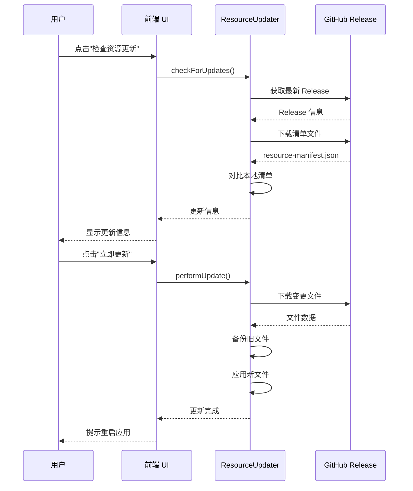

# 资源自动更新功能

## 概述

本应用实现了**增量资源热更新**功能,允许在不重新安装应用的情况下,动态更新前端资源、技能文件、MCP 配置等打包资源。

## 功能特性

### ✅ 已实现功能

1. **版本检测**
   - 自动检测远程资源版本
   - 对比本地和远程资源清单
   - 计算需要更新的文件和大小

2. **增量更新**
   - 只下载变更的文件
   - 支持断点续传
   - 显示更新进度

3. **热更新**
   - 更新完成后重启应用即可生效
   - 无需重新下载和安装完整安装包
   - 自动备份旧版本资源(保留最近3个备份)

4. **自动检查**
   - 应用启动后自动检查更新(仅打包版本)
   - 默认每24小时检查一次
   - 可在设置中手动检查

### 📦 支持更新的资源类型

- `dist/` - 前端构建产物
- `resources/skills/` - 技能文件
- `resources/mcp/` - MCP 配置
- `resources/node/` - 内置 Node.js
- `resources/playwright/` - Playwright 浏览器

## 使用方式

### 用户端

1. **自动检查**
   - 应用启动后会自动在后台检查资源更新
   - 有更新时会在设置页面显示提示

2. **手动检查**
   - 打开设置 → 关于标签
   - 点击"检查资源更新"按钮
   - 如果有更新,点击"立即更新"按钮
   - 更新完成后点击"立即重启"应用新资源

### 开发者端

1. **生成资源清单**
   ```bash
   npm run build:manifest
   ```
   这会生成 `resource-manifest.json` 文件,包含所有监控资源的 hash 和元信息。

2. **发布新版本**
   - 推送带有版本标签的提交(如 `v0.0.14`)
   - GitHub Actions 会自动构建并生成资源清单
   - 清单文件会和安装包一起上传到 Release

3. **资源清单格式**
   ```json
   {
     "version": "0.0.14",
     "buildTime": 1704067200000,
     "files": {
       "dist/index.html": {
         "hash": "abc123...",
         "size": 1024,
         "path": "dist/index.html"
       },
       ...
     }
   }
   ```

## 技术实现

### 架构设计

```
┌─────────────────┐
│  GitHub Release │  存储资源清单和更新包
└────────┬────────┘
         │
         │ 检查更新
         ↓
┌─────────────────┐
│ ResourceUpdater │  资源更新器
└────────┬────────┘
         │
         ├─→ 版本检测
         ├─→ 清单对比
         ├─→ 增量下载
         ├─→ 应用更新
         └─→ 备份管理
```

### 核心组件

1. **ResourceUpdater** (`electron/updater/ResourceUpdater.ts`)
   - 负责资源更新的核心逻辑
   - 包括检测、下载、应用更新
   - 管理本地清单和备份

2. **清单生成器** (`scripts/generate-resource-manifest.mjs`)
   - 在构建时扫描资源目录
   - 计算每个文件的 SHA-256 hash
   - 生成完整的资源清单

3. **前端 UI** (`src/components/SettingsView.tsx`)
   - 显示更新信息和进度
   - 提供手动检查和更新按钮
   - 处理用户交互

### 更新流程



## 配置说明

### 修改检查间隔

在 `electron/main.ts` 中:

```typescript
// 默认每24小时检查一次
resourceUpdater.startAutoUpdateCheck(24)

// 修改为每12小时检查一次
resourceUpdater.startAutoUpdateCheck(12)
```

### 添加/移除监控目录

在 `scripts/generate-resource-manifest.mjs` 中修改 `WATCH_DIRS`:

```javascript
const WATCH_DIRS = [
  'dist',
  'resources/skills',
  'resources/mcp',
  'resources/node',
  'resources/playwright',
  // 添加新目录
  'resources/custom'
]
```

### 排除文件模式

在清单生成脚本中修改 `EXCLUDE_PATTERNS`:

```javascript
const EXCLUDE_PATTERNS = [
  /node_modules/,
  /\.git/,
  /\.DS_Store/,
  /Thumbs\.db/,
  /\.map$/,
  // 添加新的排除模式
  /\.tmp$/
]
```

## 安全考虑

1. **文件完整性**
   - 使用 SHA-256 验证文件完整性
   - 下载失败会保留旧版本文件

2. **备份机制**
   - 更新前自动备份旧文件
   - 保留最近3个版本的备份
   - 更新失败可手动恢复

3. **权限控制**
   - 只更新应用自己的资源目录
   - 不修改系统文件或其他应用

## 故障排查

### 更新失败

1. **检查网络连接**
   - 确保能访问 GitHub API
   - 检查防火墙设置

2. **查看日志**
   ```
   打开开发者工具 → Console 标签
   搜索 "[ResourceUpdater]" 相关日志
   ```

3. **手动恢复**
   - 备份文件位置: `~/Library/Application Support/qacowork/updates/backup/`
   - 从备份中复制文件回应用目录

### 清单文件未生成

1. **检查构建脚本**
   ```bash
   npm run build:manifest
   ```

2. **验证资源目录**
   - 确保 `dist/` 目录存在
   - 确保 `resources/` 目录完整

## 未来优化

### 短期优化

- [ ] 支持差分更新(仅传输文件变更部分)
- [ ] 添加更新重试机制
- [ ] 支持自定义更新源(非 GitHub)
- [ ] 添加更新回滚功能

### 长期优化

- [ ] 支持资源包压缩传输
- [ ] 实现真正的 zip 包内文件提取
- [ ] 添加更新通知推送
- [ ] 支持分片下载大文件
- [ ] 添加 CDN 加速支持

## 相关文件

- `electron/updater/ResourceUpdater.ts` - 资源更新器
- `scripts/generate-resource-manifest.mjs` - 清单生成器
- `src/components/SettingsView.tsx` - 设置界面(更新 UI)
- `.github/workflows/release.yml` - CI/CD 配置

## 开发调试

### 本地测试

1. **生成测试清单**
   ```bash
   npm run build
   npm run build:manifest
   ```

2. **模拟远程清单**
   - 修改清单中的版本号和 hash
   - 放置到模拟的服务器或使用本地文件

3. **测试更新流程**
   ```typescript
   // 在开发者工具 Console 中
   await window.ipcRenderer.invoke('resource:check-update')
   ```

### 日志输出

所有更新相关日志都以 `[ResourceUpdater]` 前缀标记,方便过滤:

```
[ResourceUpdater] Checking for resource updates...
[ResourceUpdater] Found 15 files to update (2.3 MB)
[ResourceUpdater] Downloading dist/index.html...
[ResourceUpdater] Updated: dist/index.html
[ResourceUpdater] Resource update completed successfully
```

## 常见问题

**Q: 资源更新会影响用户数据吗?**

A: 不会。资源更新只修改应用资源文件,不会影响用户配置、会话历史等存储在 userData 目录的数据。

**Q: 更新失败会导致应用无法使用吗?**

A: 不会。更新前会自动备份,失败时保留旧版本文件。应用仍可正常运行。

**Q: 可以禁用自动检查吗?**

A: 目前自动检查仅在打包版本中启用。开发版本默认不启用自动检查。

**Q: 更新需要多久?**

A: 取决于网络速度和更新大小。通常几秒到几分钟不等。增量更新只下载变更文件,速度更快。

## 许可证

本功能遵循项目的 Apache-2.0 许可证。
